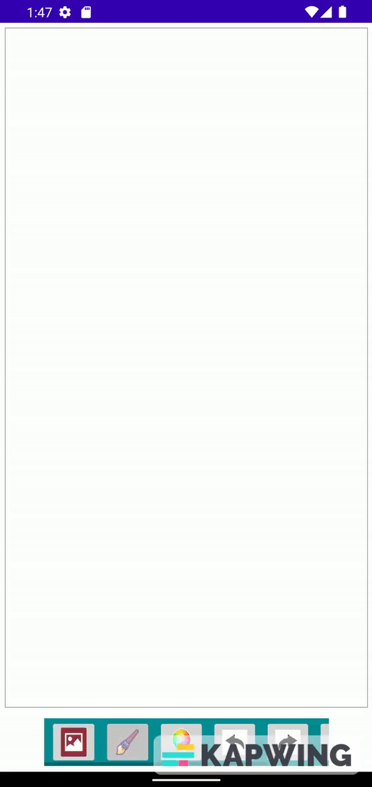
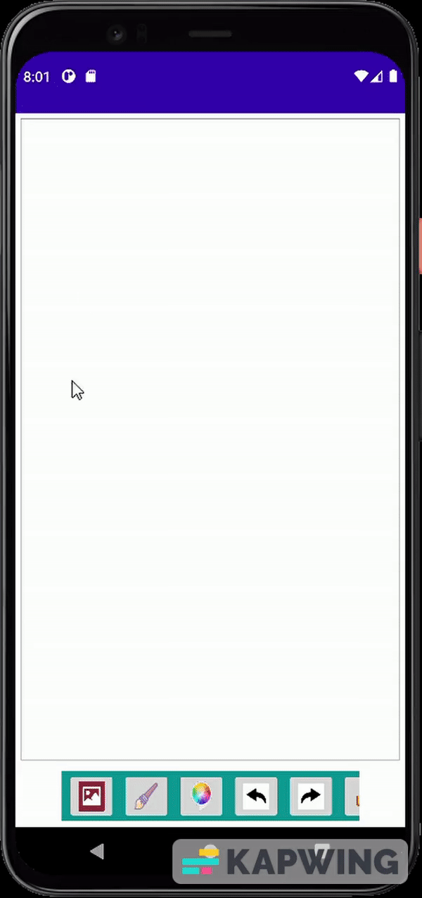
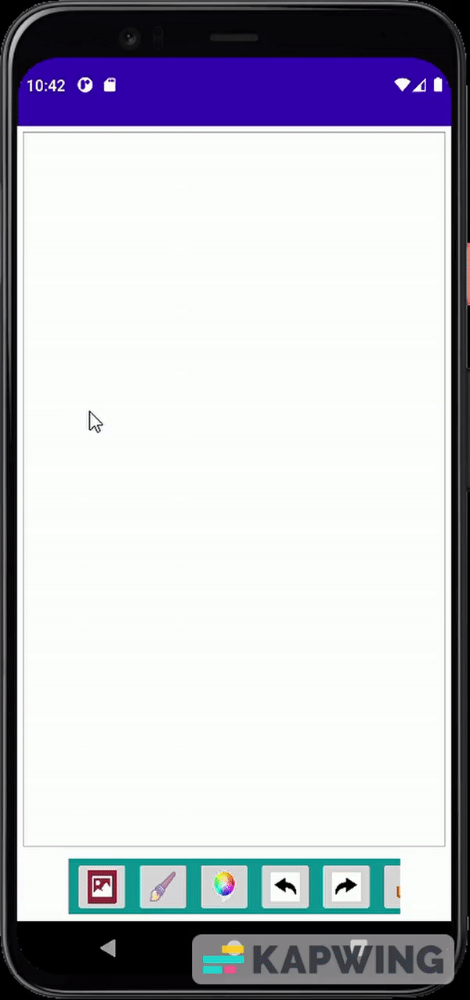

# Android-DrawingApp
App that can create, store and share drawings. It contains a scrollable toolbar for carrying out all the drawing tasks, with its features listed down below.

  

# **Toolbar Features**
## Background Image
A background image can be inserted to replace the default white background. The background image is to be selected from the gallery. But before accessing the gallery, permission from the user is required. 

  

## **Brush Size Selector**
The brush size can be adjusted by either picking it from a set of 3 given sizes (small, medium, large) or a custom size can be chosen by using the slider. 

  

## **Color Wheel**
The color wheel can be used to change the brush color, along with two sliders that change the opacity, using the vertical slider, and intensity, using the horizontal slider, of the color. 

  

## **Undo and Redo Actions**
Any lines sketched can be erased and brought back in the chronological order.

  

## **Download / Share**
The drawings/sketches can be saved in the gallery, for which access is to be granted by the user first, and/or shared via any medium. Sharing does not save the image in gallery and instead, saves the image in external cache with it being deleted once the app is closed. 

  

## **Extra Features**
1) Background can be removed by holding the background selection icon.
2) During color selection, current color box can be clicked to select it as new chosen color, if needed.
3) Pressing and holding the undo icon completely clears the drawing canvas.
